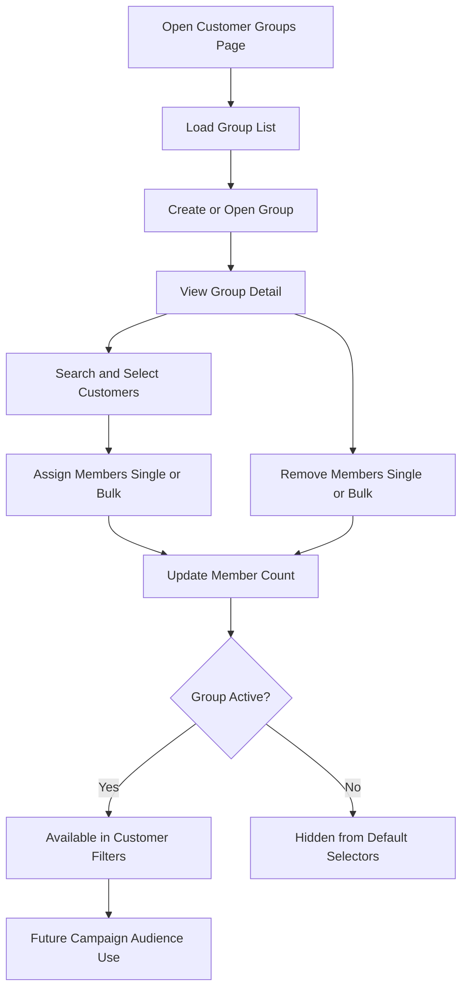

CUSTOMER GROUPS MODULE ROUTE FLOW

FLOW SUMMARY
Manual customer segmentation flow for targeted outreach readiness.

--------------------------------------------------
1. OPEN CUSTOMER GROUPS PAGE
- User opens Customer Groups module.
- System loads groups list with member counts.

--------------------------------------------------
2. CREATE GROUP
- Click Create Group.
- Enter name, optional description/tags.
- Save as ACTIVE.
- Enforce unique group name per tenant.

--------------------------------------------------
3. VIEW GROUP DETAIL
- Open group detail page.
- Show summary and current members.
- Support member search and pagination.

--------------------------------------------------
4. ASSIGN CUSTOMERS TO GROUP
- Add customers via single select or bulk select.
- Skip existing memberships safely (idempotent behavior).
- Update memberCount after assignment.

--------------------------------------------------
5. REMOVE CUSTOMERS FROM GROUP
- Remove single member or bulk members.
- Keep historical audit metadata (who/when).
- Membership becomes inactive or removed per policy.

--------------------------------------------------
6. GROUP STATUS LIFECYCLE
- ACTIVE: visible for assignment and filters.
- INACTIVE: hidden from default selectors but retained for history.

--------------------------------------------------
7. CROSS-MODULE USAGE
- Customers module can filter by group.
- Future campaign module consumes group audience.

--------------------------------------------------
8. VALIDATION RULES
- All operations must be tenant-scoped.
- Duplicate group names are blocked.
- Duplicate assignment of same customer to same group is blocked/skipped.
- Bulk operations return added/skipped/failed summary.
