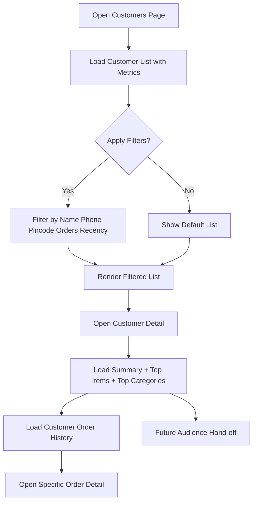

CUSTOMERS MODULE ROUTE FLOW

FLOW SUMMARY
Customer intelligence flow for repeat-order tracking and campaign readiness.

--------------------------------------------------
1. OPEN CUSTOMERS PAGE
- User opens Customers module.
- System loads paginated customer list with metrics.
- Default view shows customers with at least one order.

--------------------------------------------------
2. APPLY FILTERS
- Search by name/phone.
- Filter by pincode.
- Filter by order count range.
- Filter by last order date range.
- Future: filter by customer group.

--------------------------------------------------
3. LIST VIEW METRICS
For each customer row show:
- totalOrders
- totalSpend
- averageOrderValue
- lastOrderAt
- primaryPincode

--------------------------------------------------
4. CUSTOMER DETAIL DRILLDOWN
- Click customer row to open detail.
- Show profile summary + customer metrics.
- Show top purchased items/categories.
- Show order history timeline (paginated).

--------------------------------------------------
5. ORDER HISTORY NAVIGATION
- From customer detail, open specific order details.
- Preserve order snapshots and historical totals.

--------------------------------------------------
6. FUTURE CAMPAIGN READINESS
- Prepare audience based on customer filters.
- Hand off selected customers to campaign module (future).

--------------------------------------------------
7. VALIDATION RULES
- Every query must be tenant-scoped.
- List and detail APIs must be paginated/filterable.
- Draft-only customers/orders should not distort spend metrics.
- Error and empty states must be explicit in UI.
