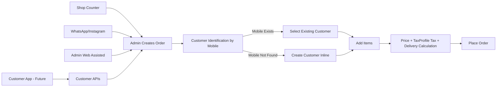
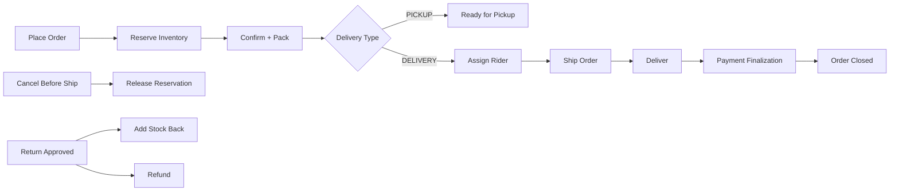
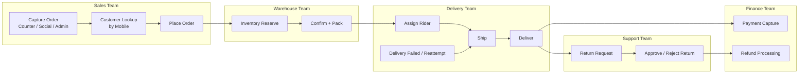

# Order Management Flow (Customer Presentation)

## What This Module Solves
This module helps a business handle orders from multiple channels in one system:

- Shop counter orders
- Social channel orders (WhatsApp/Instagram)
- Admin web-assisted orders
- Future customer app orders (API-ready, UI out of current scope)

Current rollout is India-first (INR, GST, IST).

## Channels And Entry Flow


## Master End-To-End Flow (Simple)
```mermaid
flowchart TD
    A[Order Source\nShop Counter / Social / Admin] --> B[Create Order Draft]
    B --> C[Customer by Mobile]
    C -->|Found| D[Select Existing Customer]
    C -->|Not Found| E[Create Customer]

    D --> F[Add Items + Qty]
    E --> F

    F --> G[Pricing Snapshot\nSubtotal + Discount + GST(TaxProfile) + Delivery]
    G --> H[Place Order]

    H --> I[Reserve Inventory]
    I --> J[CONFIRMED]
    J --> K[PACKED]

    K --> L{Delivery Type}
    L -->|PICKUP| M[Ready for Pickup]
    L -->|DELIVERY| N[Assign Rider]

    N --> O[SHIPPED]
    O --> P[DELIVERED]

    J --> Q[CANCELLED]
    K --> Q

    P --> R{Return Requested?}
    R -->|No| S[Order Completed]
    R -->|Yes| T[RETURN_REQUESTED]
    T --> U[RETURNED]
    U --> V[REFUNDED]
```

## End-To-End Order Lifecycle

```mermaid
flowchart TD
    O1[DRAFT] --> O2[PLACED]
    O2 --> O3[CONFIRMED]
    O2 --> O8[CANCELLED]

    O3 --> O4[PACKED]
    O3 --> O8

    O4 --> O5[SHIPPED]
    O4 --> O8

    O5 --> O6[DELIVERED]
    O5 --> O9[RETURN_REQUESTED]

    O6 --> O9
    O9 --> O10[RETURNED]
    O9 --> O8
    O10 --> O11[REFUNDED]
```


## Inventory, Delivery, And Payment Integration


## Operational Swimlane Flow (Team View)


## Admin Screen Flow (How Team Uses It)
1. Open Order Management.
2. Create order from source: Shop Counter, Social DM, or Admin Assisted.
3. Enter mobile number:
- If customer exists, select profile.
- If not, create customer quickly.
4. Add variants and quantities.
5. Review pricing snapshot (subtotal, discount, tax, delivery charge, grand total).
6. Place order.
7. Move order through status: Confirm -> Pack -> Ship -> Deliver.
8. If delivery order, assign rider before shipping.
9. Handle cancellations/returns/refunds when needed.

## Key Business Controls
- Tenant-safe data isolation for SaaS.
- Price snapshots prevent historical order drift.
- Centralized Tax Profile mapping ensures consistent GST calculation.
- Inventory reservation prevents over-selling.
- Audit trail for status/payment/refund/rider actions.
- Source tracking (counter/social/admin/customer) for analytics.

## Scope Note
- This module delivers admin-side order operations now.
- Customer app UI is a separate future project.
- APIs are designed so customer app can plug in later without redesign.
